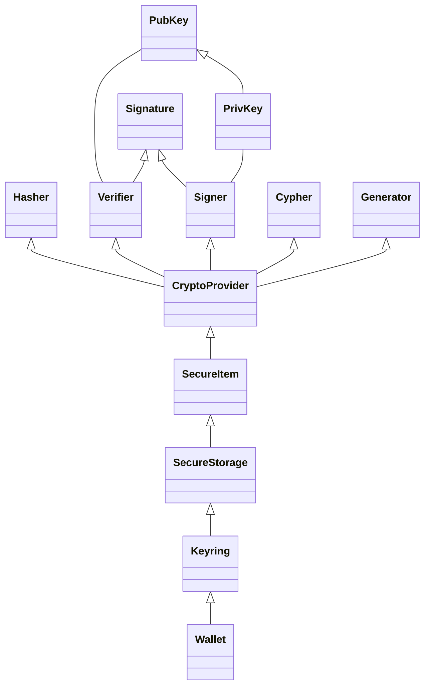
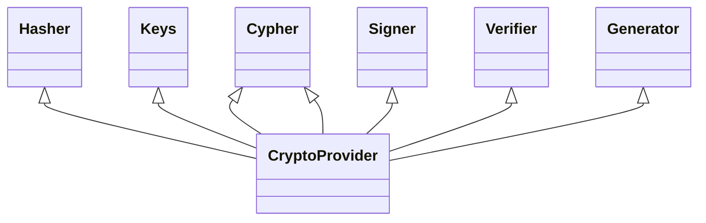
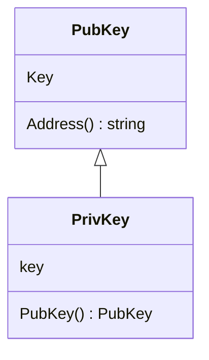
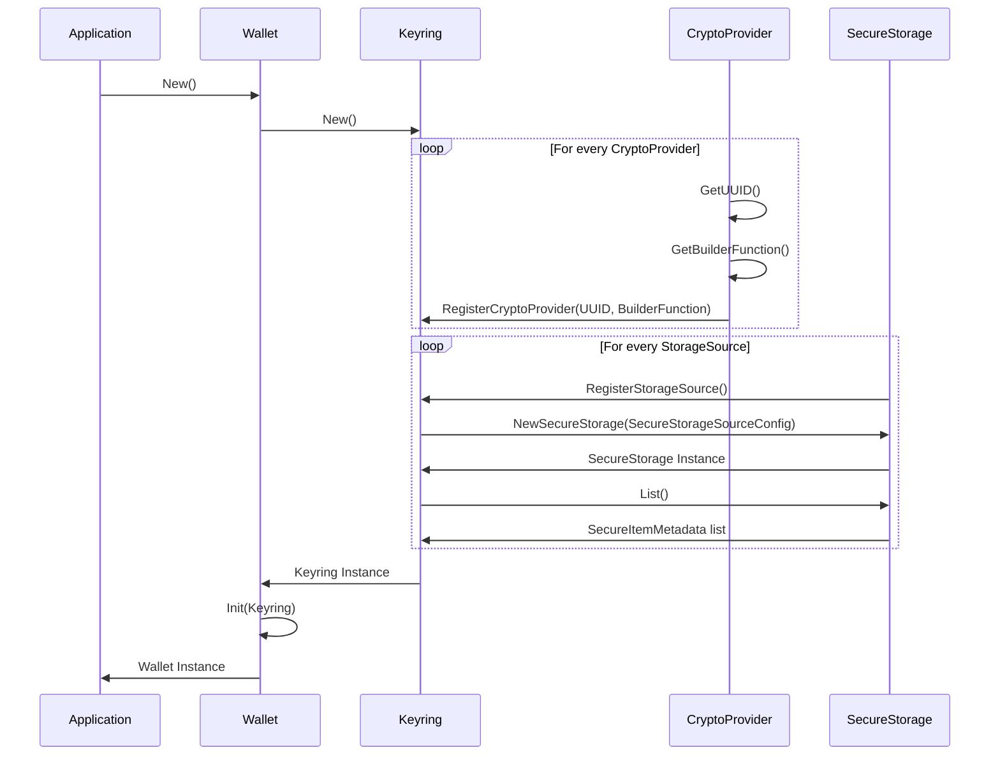
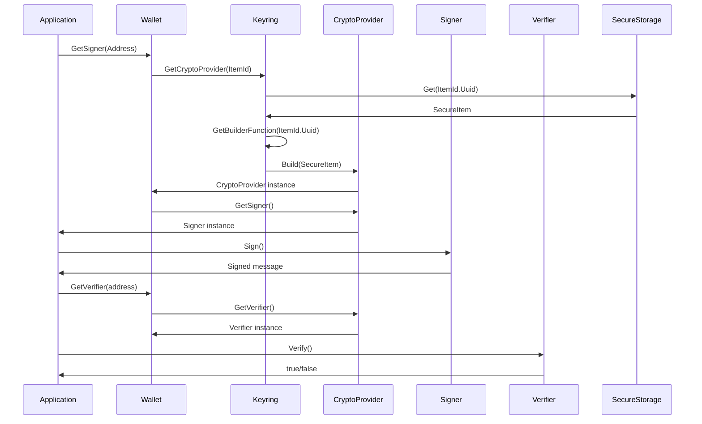

# ADR 777: Cryptography v2

## Change log

* {date}: {change log}
* ????-??-??: Initial Draft

## Status

{DRAFT | PROPOSED} Not Implemented

### Glossary

1. **Interface**: In the context of this document, "interface" refers to Go's interface concept.

2. **Module**: In this document, "module" refers to a Go module. The proposed ADR focuses on the Crypto module V2, which suggests the introduction of a new version of the Crypto module with updated features and improvements.

3. **Package**: In the context of Go, a "package" refers to a unit of code organization. Each proposed architectural unit will be organized into packages for better reutilization and extension.


## Abstract

This ADR proposes a refactor of the crypto module to enhance modularity, reusability, and maintainability,
while prioritizing developer experience and incorporating best security practices.
The proposal defines a clear division of scope for each component, cleaner interfaces, easier extension,
better test coverage and a single place of truth, allowing the developer to focus on what's important
while ensuring the secure handling of sensitive data throughout the module.  

## Context

* Currently, there is no ADR providing a comprehensive description of the cryptographic module in the Cosmos SDK.
* There have been multiple requests for a more flexible and extensible approach to cryptography, address management, and more.
* Several open issues require significant changes for resolution.
* Similar efforts have been undertaken in the past concerning runtime modules.
* Existing signing types outside of the crypto module may pose challenges to backward compatibility while striving for a clean interface.
* Security implications must be considered during the module's redesign.

### Objectives

Modular Design Philosophy

* Establish a flexible and extensible foundation using interfaces to enable the seamless integration of various cryptographic methods and tools.

* Restructure, Refactor, and Decouple: Update the cryptography module to ensure modularity and future adaptability.

Documentation & Community Engagement

* Cryptography v2 ADR: Draft a new Architecture Decision Record to guide and document the evolution of the module (this document).

* Enhance documentation to ensure clarity and promote community engagement, providing a platform for feedback and collaborative growth.

Backward Compatibility & Migration

* Prioritize compatibility with previous module versions to avoid disruptions for existing users.

* Design and propose a suitable migration path, ensuring transitions are as seamless as possible.

* Evaluate and decide on the relevance of existing systems and tools, incorporating or deprecating them based on their alignment with the module's new vision.

Developer-Centric Approach

* Prioritize clear, intuitive interfaces and best-practice design principles.
* Improve Developer Experience: Provide tools, samples, and best practices to foster an efficient and user-friendly development environment.

Leverage Extensibility

* Utilize the module's modular design to support a wide range of cryptographic tools, key types, and methods, ensuring adaptability for future technological advancements.
* Integrate support for advanced cryptographic features, ensuring the module's position at the forefront of cryptographic technologies.

Quality Assurance

* Enhanced Test Coverage: Improve testing methodologies to ensure the robustness and reliability of the module.
* Conduct an Audit: After implementation, perform a comprehensive audit to identify potential vulnerabilities and ensure the module's security and stability.

### Technical Goals

Hardware Device & Cloud-based HSM Interface Design:

* Design a foundational interface for various hardware devices (Ledger, YubiKey, Thales, etc.) and cloud-based HSMs (Amazon, Azure) to cater to both current and future implementations.

TPM 2.0 Interface Consideration:

* Integrate design considerations for Trusted Platform Module (TPM) 2.0 support to anticipate future enhancements.

PKCS#11 Interface Blueprint:

* Incorporate the Cryptographic Token Interface Standard (PKCS#11) into the design, ensuring seamless future interactions with cryptographic tokens.

Plugin Architecture and Dependency Injection:

* Establish the architectural foundation for an extensible plugin system and integrate a dependency injection framework, ensuring modularity, testability, and third-party integrations.

Plugin Sandbox Environment Blueprint:

* Design an environment for plugin testing, ensuring developers can validate integrations without compromising system integrity.

Extensibility for Cryptographic Techniques:

* Design the system with extensibility in mind to accommodate a broad spectrum of cryptographic techniques such as:
* Various signature types
* Different key types (elliptic curve, RSA, etc.)
* Post-Quantum Cryptography (PQC) methods
* Threshold signatures and encryption
  Community Engagement Infrastructure:

* Structure the design with tools and documentation interfaces in mind, enabling a seamless future rollout of resources for developer engagement.

## Proposed architecture

### **Packages**

The following packages aim to encapsulate behaviours and to provide simple interfaces to extend and reuse.



#### Crypto provider

The *Crypto provider* serves as a middleware component responsible for managing the interaction with various instantiated cryptographic packages. It acts as a centralized controller, encapsulating the API of the crypto modules in a single location.
Through the Crypto provider, users can access functionality such as signing, verification, encryption, and hashing.

By abstracting the underlying cryptographic functionality, the *Crypto provider* enables a modular and extensible architecture. It allows users to easily switch between different cryptographic implementations without impacting the rest of the system.



```go

type CryptoProviderBuilder func(SecureItem) (CryptoProvider, error)

type ProviderBasicOptions interface {
  CanProvidePubKey() bool
  CanProvidePrivateKey() bool
  CanExport() bool
  CanSign() bool
  CanVerify() bool
  CanCipher() bool
  CanGenerate() bool
}

type CryptoProvider interface {
  ProviderBasicOptions 
  
  GetBuilder() CryptoProviderBuilder
  GetUUID() string
  
  GetSigner() (Signer, error)
  GetVerifier() (Verifier, error)
  GetCipher() (Cipher, error)
  GetHasher() (Hasher, error)
  GetGenerator() (Generator, error)
}
```

##### **SecureItem**

A *Secure Item* is a structured data object designed for storing any type of data within a *Secure Storage* instance.
In the context of this ADR, the **Blob** field of a Secure Item represents a "recipe" or blueprint for constructing the corresponding *Crypto Provider*.
The **Blob** can be encoded in any format and should contain all the necessary configuration information required to instantiate the specific
cryptographic packages that compose the *Crypto Provider*.

```go
type ItemId struct {
  UUID string // UUID of the SecureItem
  Type string // Backend type Ledger/Yubikey/FS
  Slot string // Token identifier Yubikey's slot number / Ledger's HD path
}

type SecureItemMetadata struct {
  ModificationTime time.Time
  ItemId           ItemId
}

type SecureItem struct {
  Metadata SecureItemMetadata
  // Blob format/encoding will be dependant of the CryptoProvider implementation
  Blob []byte
}
```

##### SecureStorage

A *Secure Storage* represents a secure vault where one or more *Secure Items* can be stored. It serves as a centralized repository for securely storing sensitive data. To access a *Secure Item*, users must interact with the *Secure Storage*, which handles the retrieval and management of keys.
Different implementations of *Secure Storage* will be available to cater to various storage requirements:

* FileSystem: This implementation stores the Secure Items in a designated folder within the file system.
* Memory: This implementation stores the Secure Items in memory, providing fast access but limited persistence.
* Keychain: This implementation is specific to macOS and utilizes the Keychain feature to securely store the Secure Items.

```go
type SecureStorageSourceMetadata struct {
    Type string
    Name string
}

type SecureStorageSourceConfig struct {
    Metadata SecureStorageSourceMetadata
    Config   any // specific config for the desired backend, if necessary
}

type SecureStorage interface {
  NewSecureStorage(SecureStorageSourceConfig) (SecureStorage, error)
  Get(uuid string) (SecureItem, error)
  GetMetadata(uuid string) (SecureItemMetadata, error)
  Set(SecureItem) error
  Remove(uuid string) error
  Items() ([]SecureItemMetadata, error)
}
```

##### **Keyring**

*Keyring* serves as a central hub for managing *Crypto Providers* and *Secure Storage* implementations. It provides methods to register *Crypto Provider*
and *Secure Storage* implementations. The **RegisterCryptoProvider** function allows users to register a Crypto Provider blueprint by providing a unique identifier and a builder function. Similarly, the **RegisterSecureStorage** function enables users to register a secure storage implementation by specifying a unique identifier and a builder function.


```go
type Keyring interface {
	RegisterCryptoProviderBuilder(uuid string, builder ProviderBuilder)
	RegisterSecureStorageBuilder(uuid string, builder SecureStorageBuilder)

	GetCryptoProvider(ItemId) (CryptoProvider, error)
	List() ([]ItemId, error)
}
```

#### **Wallet**

The Wallet interface contains the blockchain specific use cases of the crypto module. It also serves as an API for:

* Signing and Verifying messages.
* Generating addresses out of keys

Since wallet interacts with the user keys, it contains an instance of the Keyring, it is also where the blockchain specific
logic should reside.

```go
type Wallet interface {
	Init(Keyring)
	GetSigner(address string) Signer
	GetVerifier(address string) Verifier
	Generate() string
}
```

#### Additional components

##### Blob

This is a wrapper for the widely used `[]byte` type that is used when handling binary data. Since crypto module handles sensitive information,
the objective is to provide some extra security capabilities around such type as:

* Zeroing values after a read operation.
* Securely handling data.

These blob structures would be passed within components of the crypto module. For example: Signature information

#### **Keys**

A key object is responsible for containing the **BLOB** key information. Keys might not be passed through functions and it is 
suggested to interact through crypto providers to limit the exposure to vulnerabilities. 



Base Key struct

```go
type KeyStruct struct {
 key Blob
}
```

Base key interface (common to private and public keys)

```go
type BaseKey interface {
 String() string
 Bytes() Blob
}
```

The generator module is responsible for generating such keys.

##### PubKey

```go
type PubKey interface {
 BaseKey
}
```

##### PrivKey

```go
type PrivKey interface {
 BaseKey
 Pubkey() PubKey //Generate a public key out of a private key
}
```

#### Signatures

A signature consists of a message/hash signed by one or multiple private keys. The main objective is to Authenticate a message signer 
through their public key.

```go
type Signature struct {
 data Blob
}
```

##### Signer

Interface responsible for Signing a message and returning the generated Signature. It is an algorithm tied to a family of keys. 

```go
type Signer interface {
 Sign(Blob, PrivKey) (Signature, error)
}
```

##### Verifier

Verifies if given a message belongs to a public key by validating against it's respective signature.

```go
type Verifier interface {
 Verify(Blob, Signature, PubKey) (bool, error)
}
```

#### Cipher

A cipher is an api for encryption and decryption of data. Given a message it should operate through a secret.

```go
type Cipher interface {
    Encryptor
    Decryptor
}
```

##### Encryptor

Given a message and a secret, ciphers such message according to the implemented algorithm.

```go
type Encryptor interface {
    Encrypt(message Blob, secret Blob) (encryptedMessage Blob, error)
}
```

##### Decryptor

Given a Ciphered message and a secret, decrypts such message according to the implemented algorithm.

```go
type Decryptor interface {
    Decrypt(message Blob, secret Blob) (decryptedMessage Blob, error)
}
```

##### Hasher

This module contains the different hashing algorithms and conventions agreed on this matter. 

```go
type Hasher interface {
 Hash(input Blob) Blob
 CanHashIncrementally() bool
}
```

#### Module structure

Crypto module structure would look similar to this

- crypto/
  - docs
  - cipher/
    - encryption
    - decryption
    - hashing
  - signer/
    - signature
    - verifier
  - keyring/
    - secure_item
    - secure_storage
  - keys
  - crypto_provider
  - wallet

**Flow overview**

***Initialization***



***Signing and verifying a message***



## Alternatives

The alternatives may vary in the way of distributing the packages, grouping them together as for example verify and signing in 
one place. This will affect the granularity of the code, thus the reusability and modularity. We aim to balance between simplicity and 
granularity.

## Decision

We will:

* Refactor module structure as described above.
* Define types and interfaces as the code attached.
* Refactor existing code into new structure and interfaces.
* Implement Unit Tests to ensure no backward compatibility issues.

## Consequences

### Backwards Compatibility

This refactor will involve changes on how the module is structured, providing cleaner interfaces and easier ways to use and extend. The impact should be minimal and not breaking any previous generated data.

The backward compatible sensitive elements are:

* Keys
* Signatures
* Encrypted data
* Hashes

### Positive

* Single place of truth
* Easier to use interfaces
* Easier to extend
* Unit test for each crypto module
* Greater maintainability
* Incentivize addition of implementations instead of forks
* Decoupling behaviour from implementation
* Sanitization of code

### Negative

* It will involve an effort to adapt existing code.
* It will require attention to detail and audition.

### Neutral

* It will involve extensive testing.

## Test Cases

- The code will be unit tested to ensure a high code coverage
- There should be integration tests around Wallet, keyring and crypto providers.
- There should be benchmark tests for hashing, keyring, encryption, decryption, signing and verifying functions.

## Further Discussions

> While an ADR is in the DRAFT or PROPOSED stage, this section should contain a
> summary of issues to be solved in future iterations (usually referencing comments
> from a pull-request discussion).
>
> Later, this section can optionally list ideas or improvements the author or
> reviewers found during the analysis of this ADR.


## References

* {reference link}
