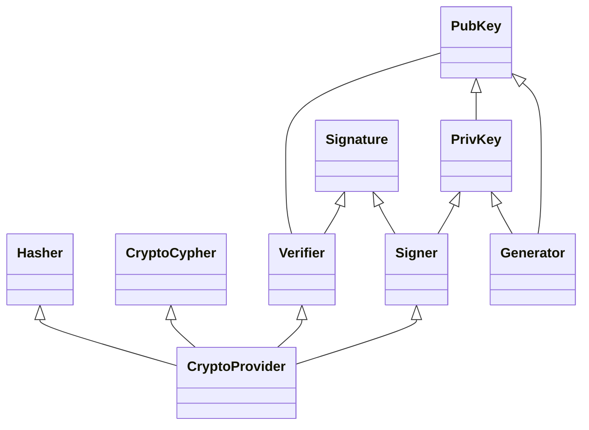
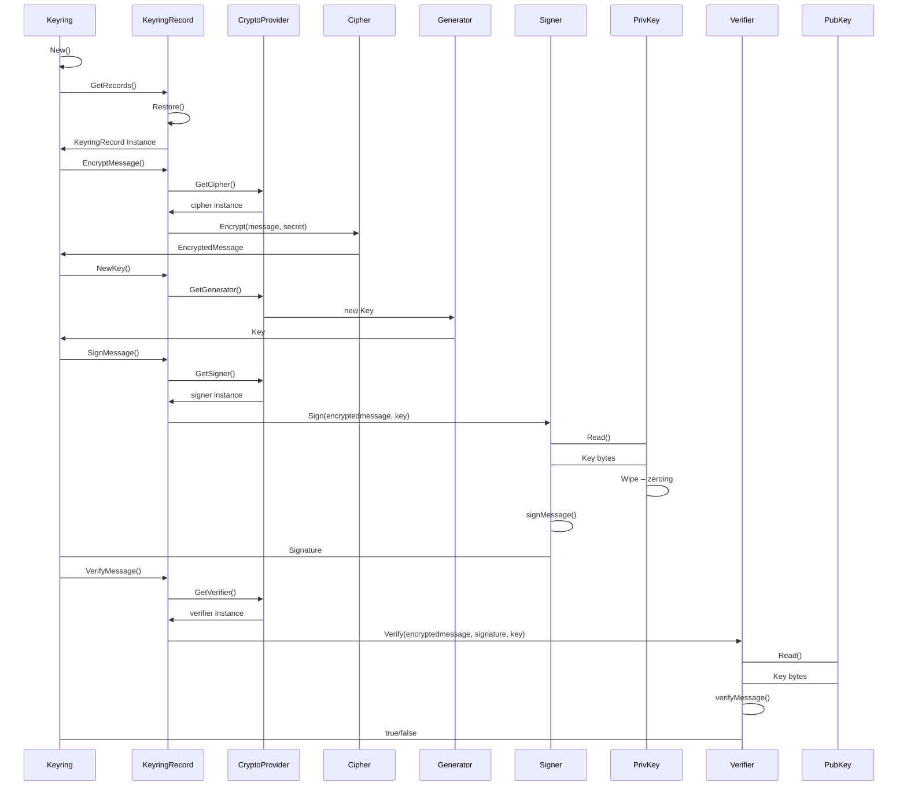

# ADR 777: Cryptography v2

## Change log

* {date}: {change log}
* ????-??-??: Initial Draft

## Status

{DRAFT | PROPOSED} Not Implemented

## Abstract

The crypto module refactor aims to make the module a reliable resource to use across cosmos related projects and among any go projects. As a guideline we are pursuing the X standard.

## Context

> This section describes the forces at play, including technological, political,
> social, and project local. These forces are probably in tension, and should be
> called out as such. The language in this section is value-neutral. It is simply
> describing facts. It should clearly explain the problem and motivation that the
> proposal aims to resolve.

> {context body}

### Proposed architecture

The architecture objectives that define our design are based on the following concepts:

* **Modularity**: Users should be able to use only what they need independently
* **Extensibility**: Adding or modifying a module should be easy
* **Simplicity**: Users should be able to use/interacts confidently with components trough minimal requirements and interactions.

### **Modules**

Modules aim to encapsulate behaviours and to provide simple interface to extend and reuse.



#### Types

Each module will have its own types to keep everything as isolated as possible, yet there are some basic types shared across all part of the crypto module itself.

##### Blob

This is a wrapper for the widely used `[]byte` array. Since crypto module handles sensitive information, the objective is to provide some extra security around such type Like Zeroing its values after a read operation.

#### Crypto provider

A Crypto provider is the middleware object that handles the interaction with different instanced modules, A provider could be seen as a controller.

``` go
type CryptoProvider interface {
 CanProvidePubKey() bool
 CanProvidePrivKey() bool
 Consign() bool
 CanVerify() bool
 CanCipher() bool
 CanGenerate() bool

 GetSigner() (signer. Signer, error) 
 GetVerifier() (verifier. Verifier, error) 
 GetGenerator() (keys.KeyGenerator, error)
 GetCipher() (cypher.Cipher, error) 
 GetHasher() (Hasher, error) 
}
```

#### **Keyring**

Keyring serves as a middleware between ledgers and the cosmos-sdk modules. It performs operations of storing, retrieving data and allowing ledgers to perform operations such as signing and verifying.

##### KeyringRecord

A keyring record uses a crypto provider, and serves as a bridge between a specific ledger and the modules implementations, enabling ledgers to use the crypto module desired implementations, it should follow this interface:

``` go
// Equivalent to record?
type KeyringRecord interface {
 CryptoProvider // ledger, localKP, remoteKP, etc.

 EncryptionProvider() // localKP, remoteKP, etc.
 Store() error
 Restore() error
}
```

Examples: Ledger nano, Trezos, remoteKeyProvider

##### SecureItem

* Metadata

##### SecureStorage

* Metadata

##### SecureElement

##### LedgerDevice

#### **Keys**

A key object is responsible for containing the **BLOB** key information required and used in the following modules:

* **Cipher**: Encrypt / Decrypt information
* **Signer**: Generate a signature
* **Verifier**: Verify signatures
* Derive new keys

These Key objects contain the algorithms to generate keys.

Base Key struct

``` go
type KeyStruct struct {
 key Blob 
}
```

Base key interface (common to private and public keys)

```go
type BaseKey interface {
 String() string
 Bytes() Blob
}
```

The generator module is responsible for generating such keys.

##### PubKey

``` go
type PubKey interface {
 BaseKey
 Address() []byte // Generates the address according to the defined types
}
```

##### PrivKey

``` go
type PrivKey interface {
 BaseKey
 Pubkey() PubKey //Generate a public key out of a private key
}
```

#### **Signatures**

A signature consists of a message/hash signed by one or multiple private keys. The main objective is to Authenticate a message signer.

``` go
type Signature struct {
 data Blob
}
```

##### Signer

Interface responsible for Signing a message and returning the generated Signature.

``` go
type Signer interface {
 Sign(Blob, PrivKey) (Signature, error)
}
```

##### Verifier

Verifies if given a message, it's signature belongs to said public key.

``` go
type Verifier interface {
 Verify(Blob, Signature, PubKey) (bool, error)
}
```

#### Cipher

A cipher is an algorithm focused for encryption and decryption of data. Given a message it should operate through a secret.

``` go
type Cipher interface {
 Encryptor
 Decryptor
}
```

##### Encryptor

Given a message and a secret, ciphers such message according to the implemented algorithm.

``` go
type Encryptor interface {
 Encrypt(message Blob, secret Blob) (encryptedMessage Blob, error)
}
```

##### Decryptor

Given a Ciphered message and a secret, decrypts such message according to the implemented algorithm.

``` go
type Decryptor interface {
 Decrypt(message Blob, secret Blob) (decryptedMessage Blob, error)
}
```

##### Example: xSalsaSymetric20

Example of cipher xSalsaSymstric20 implementation. You will see that the new implementation is cleaner and tied to an interface, ensuring that the function will be reachable by the existing code.

**Original:**

``` go
func EncryptSymmetric(plaintext, secret []byte) (ciphertext []byte) {
 if len(secret) != secretLen {}
 ...
    Return ciphertext
}

func DecryptSymmetric(ciphertext, secret []byte) (plaintext []byte, err error) {
 if len(secret) != secretLen {}
 ...
 return plaintext, nil
}
```

**New**

``` go
type SalsaCypher struct {
 Cypher
}

func (cypher SalsaCypher) Encrypt(message, secret) (Blob, err error) {
 if len(secret) != secretLen {}
 ...
 return nil, nil
}

func (cypher SalsaCypher) Decrypt(ciphertext, secret) (Blob, err error) {
 if len(secret) != secretLen {}
 ..
 return plaintext, nil
}
```

#### Hasher

Hashing functions should be placed in this module. Trough the following interface.

``` go
type Hasher interface {
 Hash(input Blob) Blob

 CanHashIncrementally() bool
}
```

### Overview of the whole design

```mermaid
classDiagram


SecureItem <|-- SecuredStorage
SecureItemMetadata <|-- SecureItem

SecuredStorage : Get(key string) (SecureItem, error)
SecuredStorage : Set(key string, item SecureItem) error
SecuredStorage : Delete(key string) error
SecuredStorage : List() ([]string, error)

CryptoCypher <|-- CryptoProvider
Hasher <|-- CryptoProvider
Signer <|-- CryptoProvider
Verifier <|-- CryptoProvider
CryptoProvider <|-- SecretElement
CryptoProvider <|-- SecretKeyPair
CryptoProvider <|-- SecureElement
CryptoProvider : GetCypher() (CryptoCypher, error)
CryptoProvider : GetHasher() (Hasher, error)
CryptoProvider : GetRandom() (Random, error)
CryptoProvider : GetRandomBytes(size int) ([]byte, error)

Hasher : Hash() ([]byte, error)
Hasher : HashString() (string, error)

SecureItem  <|-- CryptoCypher
CryptoCypher : Encrypt(data Blob) (Blob, error)
CryptoCypher : Decrypt(data Blob) (Blob, error)

Blob <|-- Digest
Blob <|-- SecureItem
Blob <|-- Hasher
Blob <|-- CryptoCypher
Blob : Bytes()
Blob : ReadBlob() ([]byte, error)
Blob : Wipe()


BaseKey <|-- PubKey
BaseKey <|-- PrivKey
BaseKey : String() string
BaseKey : Bytes() []byte

Signature <|-- Verifier
Signature <|-- Signer
Signature : Bytes() []byte

Signer 
Signer : Sign(hash []byte, key PrivKey) (Signature, error)

Verifier
Verifier : Verify(hash []byte, sig Signature, key PubKey) (bool, error)

PubKey <|-- PrivKey
PubKey : Address() string
PubKey <|-- Generator
PubKey <|-- Verifier
PubKey <|-- SecretKeyPair

PrivKey : PubKey() PubKey
PrivKey <|-- Generator
PrivKey <|-- Signer
PrivKey <|-- SecretKeyPair

Generator
Generator : GenerateKey() (PrivKey, error)
Generator : DeriveKey(pb PubKey) (PrivKey, error)


SecretElement
SecretElement <|-- LedgerDevice
```



### Example

In the following scenario the USER uses an external ledger to:

1. Load stored ledger information, and using one of the keyringRecord which represents the specific LEDGER
2. Encrypt a message trough CYPHER
3. Generate an asymetric key trough GENERATOR
4. Signing a message trough the SIGNER and the Private key
5. Verifying a message trough the VERIFIER and the Public Key

**Flow overview**



## Alternatives

The alternatives may vary in the way of distributing the modules, putting some modules together as for example verify and signing in one place. This will affect the granularity of the code, thus the reusability and modularity. We aim to balance between simplicity and granularity.

## Decision

We will:

* Refactor module structure as the images attached.
* Define types and interfaces as the code attached.
* Refactor existing code into new structure and interfaces.
* Implement Unit Tests to ensure no backward compatibility issues.

## Consequences

### Backwards Compatibility

> All ADRs that introduce backwards incompatibilities must include a section
> describing these incompatibilities and their severity. The ADR must explain
> how the author proposes to deal with these incompatibilities. ADR's submissions
> without a sufficient backwards compatibility treatise may be rejected outright.

This refactor will involve changes on how the module is structured, providing cleaner interfaces and easier ways to use and extend. The impact should be minimal and not breaking any previous generated data.

The backward compatible sensitive elements are:

* Keys
* Signatures
* Encrypted data
* Hashes

### Positive

* Single place of truth.
* Easier to use interfaces.
* Easier to extend.
* Maintainability.
* Incentivize addition of implementations instead of forks.

### Negative

* It will involve an effort to adapt existing code.
* It will require attention to detail and audition.

### Neutral

* It will involve extensive testing.

## Further Discussions

> While an ADR is in the DRAFT or PROPOSED stage, this section should contain a
> summary of issues to be solved in future iterations (usually referencing comments
> from a pull-request discussion).
>
> Later, this section can optionally list ideas or improvements the author or
> reviewers found during the analysis of this ADR.

## Test Cases [optional]

Test cases for an implementation are mandatory for ADRs that are affecting consensus
changes. Other ADRs can choose to include links to test cases if applicable.

## References

* {reference link}

