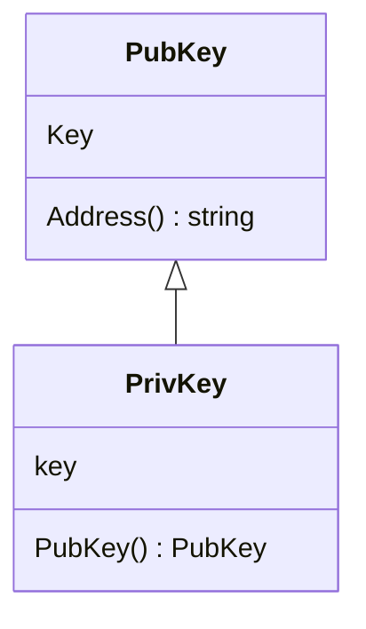
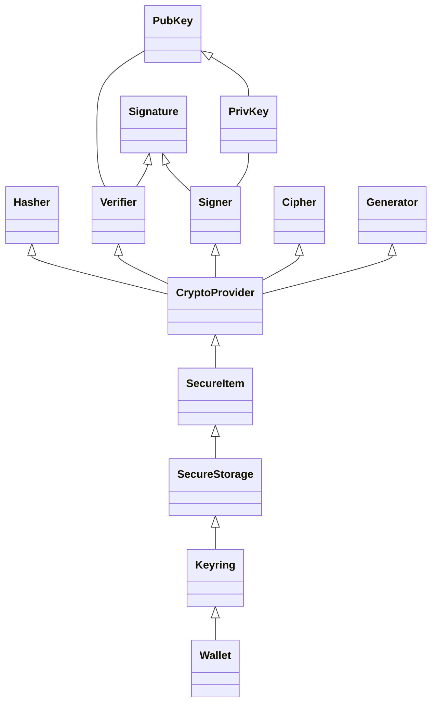
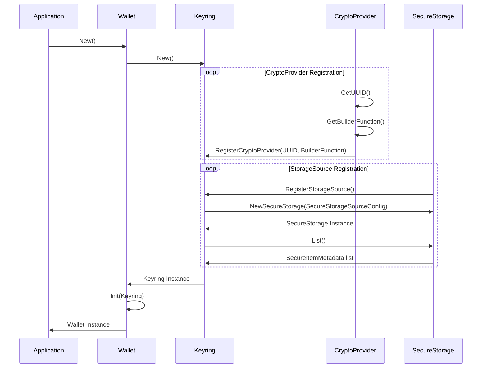
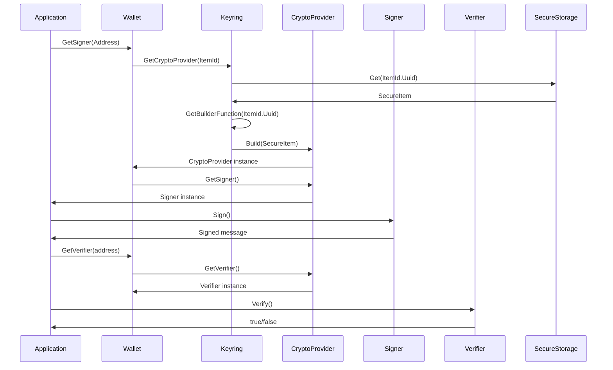

# ADR 777: Cryptography v2

## Change log

* {date}: {change log}
* ????-??-??: Initial Draft

## Status

DRAFT

### Glossary 
// TODO: make sure these words are used as described here in the rest of the document

1. **Interface**: In the context of this document, "interface" refers to Go's interface concept.

2. **Module**: In this document, "module" refers to a Go module. The proposed ADR focuses on the Crypto module V2, which suggests the introduction of a new version of the Crypto module with updated features and improvements.

3. **Package**: In the context of Go, a "package" refers to a unit of code organization. Each proposed architectural unit will be organized into packages for better reutilization and extension.

## Abstract

TODO: This should be a summary of the whole document.

This ADR proposes a refactor of the crypto module to enhance modularity, re-usability, and maintainability,
while prioritizing developer experience and incorporating best security practices.
The proposal defines a clear division of scope for each component, cleaner interfaces, easier extension,
better test coverage and a single place of truth, allowing the developer to focus on what's important
while ensuring the secure handling of sensitive data throughout the module.

This ADR introduces enhancements and deprecates the proposals outlined in the ["Keyring ADR"](https://github.com/cosmos/cosmos-sdk/issues/14940).
It is important to note that the Keyring ADR will be replaced with a significantly more flexible approach such as this
document describes.

Furthermore, the grpc service proposed in the Keyring ADR can be easily implemented by creating an implementation of the
"CryptoProvider" interface defined in this ADR. This allows for the integration of HashiCorp plugins over gRPC,
providing a robust and extensible solution for keyring functionality.

By deprecating the previous ADR and introducing these enhancements, the new ADR offers a more comprehensive and
adaptable solution for cryptography and address management within the Cosmos SDK ecosystem.

## Introduction

This ADR describes the redesign and refactoring of the crypto package:

* modularity
* security
* extensibility
* reusability and maintainability
* developer experience

The proposal determines a clear decoupling via interfaces, additional extension points, and a much more modular design to allow developers to application level aspects while ensuring the secure handling of sensitive data when applying this SDK.

The enhancements in this proposal not only render the ["Keyring ADR"](https://github.com/cosmos/cosmos-sdk/issues/14940) obsolete, but also encompass its key aspects, replacing it with a more flexible and comprehensive approach. Furthermore, the gRPC service proposed in the Keyring ADR can be easily implemented as an specialized implementation of the "CryptoProvider" interface defined later in this ADR. This allows for the integration of HashiCorp-like plugins over gRPC, providing a robust and extensible solution for keyring functionality.

## Context

* The Cosmos SDK currently lacks a comprehensive ADR for the cryptographic package.
* The demand for a more flexible and extensible approach to cryptography and address management is high.
* Significant changes are necessary to resolve several open issues.
* Similar efforts have been made in the past regarding runtime modules.
* The presence of signing types outside of the crypto module could pose backward compatibility challenges while striving for a clean interface.
* Security implications are a critical consideration during the redesign work.

## Objectives

Modular Design Philosophy

* Establish a flexible and extensible foundation using interfaces to enable the seamless integration of various cryptographic methods and tools.

* Restructure, Refactor, and Decouple: Update the cryptography codebase to ensure modularity and future adaptability.

Documentation & Community Engagement

* Cryptography v2 ADR: Draft a new Architecture Decision Record to guide and document the evolution of the module (this document).

* Enhance documentation to ensure clarity, establish a good practices protocol and promote community engagement, providing a platform for feedback and collaborative growth.

Backward Compatibility & Migration

* Prioritize compatibility with previous module version to avoid disruptions for existing users.

* Design and propose a suitable migration path, ensuring transitions are as seamless as possible.

* Evaluate and decide on the relevance of existing systems and tools, incorporating or deprecating them based on their alignment with the module's new vision.

Developer-Centric Approach

* Prioritize clear, intuitive interfaces and best-practice design principles.
* Improve Developer Experience: Provide tools, samples, and best practices to foster an efficient and user-friendly development environment.

Leverage Extensibility

* Utilize the module's modular design to support a wide range of cryptographic tools, key types, and methods, ensuring adaptability for future technological advancements.
* Integrate support for advanced cryptographic features, ensuring the module's position at the forefront of cryptographic technologies.

Quality Assurance

* Enhanced Test Coverage: Improve testing methodologies to ensure the robustness and reliability of the module.
* Conduct an Audit: After implementation, perform a comprehensive audit to identify potential vulnerabilities and ensure the module's security and stability.

## Technical Goals

Wide Hardware Device & Cloud-based HSM Interface Support:

* Design a foundational interface for various hardware devices (Ledger, YubiKey, Thales, etc.) and cloud-based HSMs (Amazon, Azure) to cater to both current and future implementations.

Plugin Architecture and Dependency Injection

* Establish the architectural foundation for an extensible plugin system and integrate a dependency injection framework, ensuring modularity, testability, and third-party integrations.

* Design an environment for plugin testing, ensuring developers can validate integrations without compromising system integrity.

Interface considerations

* Design should take into considerations support for Trusted Platform Module (TPM) 2.0 and similar devices to anticipate future enhancements.

* Design should take into account the Cryptographic Token Interface Standard (PKCS#11)

Increase cryptographic versatility

* Support for a broad spectrum of cryptographic techniques
* Extend support for more hash functions (e.g. pedersen, argon2, Argon2d/I/id, Blake3, etc.)
* Extend support for more signature schemes (e.g. secp256r1, ed25519, ed448, sr25519, etc.)
* More advanced methods ( Post-Quantum Cryptography (PQC) methods
* Threshold signatures and encryption

Community Engagement Infrastructure:

* Structure the design with tools and documentation interfaces in mind, enabling a seamless future rollout of resources for developer engagement.

## Proposed architecture

### Introduction

TODO: Introduction

### Crypto Provider

*Crypto Providers* serve as a middleware interface responsible for managing the interaction with various instantiated cryptographic packages. It acts as a centralized controller, encapsulating the API of the crypto modules in a single location.
Through each Crypto provider, users can access functionality such as signing, verification, encryption, and hashing.

By abstracting the underlying cryptographic functionality, *Crypto providers* enable a modular and extensible architecture. It allows users to easily switch between different cryptographic implementations without impacting the rest of the system.

```go=
type ProviderMetadata interface {
  key string
  value string
}

type ICryptoProviderMetadata interface {
  GetTypeUUID() TypeUUID
  GetName() string
  GetMetadata() []ProviderMetadata
}

type ICryptoProviderBuilder interface {
  ICryptoProviderMetadata
  
  FromSecureItem( item SecureItem ) (ICryptoProvider, error)  

  FromRandomness( source IRandomnessSource ) (ICryptoProvider, error)
  FromSeed( seed []byte ) (ICryptoProvider, error)
  FromMnemonic( mnemonic string ) (ICryptoProvider error)
  FromString( url string ) (ICryptoProvider error)
}

type ICryptoProvider interface {
  Proto.Message
  ICryptoProviderMetadata
  
  GetKeys() (PubKey, PrivKey, error)    
  GetSigner() (ISigner, error)
  GetVerifier() (IVerifier, error)
  GetCipher() (ICipher, error)
  GetHasher() (IHasher, error)
}
```

TODO: Make clear that we are planning to use self-references

#### Signing

TODO: explain that sometimes it is not possible to both sign and verify

Interface responsible for Signing a message and returning the generated Signature.

Verifies if given a message belongs to a public key by validating against it's respective signature.

```go
type ISigner interface {
  Sign(Blob) (Signature, error)
}
```

```go
type IVerifier interface {
  Verify(Blob, Signature) (bool, error)
}
```

#### Cipher

A cipher is an api for encryption and decryption of data. Given a message it should operate through a secret.

```go
type ICipher interface {
  Encrypt(message Blob) (encryptedMessage Blob, error)
  Decrypt(encryptedMessage Blob) (message Blob, error)
}
```

#### Hasher

This module contains the different hashing algorithms and conventions agreed on this matter.

```go
type IHasher interface {
  Hash(input Blob) Blob
  CanHashIncrementally() bool
}
```

### StorageProvider

TODO: intro
A *Secure Storage* represents a secure vault where one or more *Secure Items* can be stored. It serves as a centralized repository for securely storing sensitive data. To access a *Secure Item*, users must interact with the *Secure Storage*, which handles the retrieval and management of keys.
Different implementations of *Secure Storage* will be available to cater to various storage requirements:

* FileSystem: This implementation stores the Secure Items in a designated folder within the file system.
* Memory: This implementation stores the Secure Items in memory, providing fast access but limited persistence.
* KMS: This implementation utilizes the Key Management System available on AWS, GCP, etc.

```go
type IStorageProvider interface {
  List() []string

  Get(name string) (SecureItem, error)
  Set(item SecureItem) error
  Remove(name string) error
}
```

A *Secure Item* is a structured data object designed for storing any type of data within a *Secure Storage* instance.
In the context of this ADR, the **Blob** field of a Secure Item represents a "recipe" or blueprint for constructing the corresponding *Crypto Provider*.
The **Blob** can be encoded in any format and should contain all the necessary configuration information required to instantiate the specific cryptographic packages that compose the *Crypto Provider*.

```go
type ISecureItemMetadata interface {
  Type()   TypeUUID     // Relates to the corresponding provider
  Name()   string
  ...
}

type ISecureItem interface {
  ISecureItemMetadata

  // Blob format/encoding will be dependant of the CryptoProvider implementation
  Bytes() []byte
}
```

##### Keyring

*Keyring* serves as a central hub for managing *Crypto Providers* and *Secure Storage* implementations. It provides methods to register *Crypto Providers* and *Secure Storage* implementations.
The **RegisterCryptoProvider** function allows users to register a Crypto Provider blueprint by providing its unique identifier and a builder function. Similarly, the **RegisterSecureStorage** function enables users to register a secure storage implementation by specifying a unique identifier and a builder function.


```go
type IKeyring interface {
  // TODO: review
  RegisterCryptoProvider(typeUUID TypeUUID, builder CryptoProviderBuilder)
  RegisterAndLoadStorageProvider(typeUUID TypeUUID, provider StorageProvider)

  ListStorageProviders() ([]IStorageProvider, error)
  ListCryptoProviders() ([]ICryptoProvider, error)

  List() ([]SecureItemMetadata, error)
  
  GetCryptoProvider(ItemId) (CryptoProvider, error)
}
```

#### **Wallet**

The Wallet interface contains the blockchain specific use cases of the crypto module. It also serves as an API for:

* Signing and Verifying messages.
* Generating addresses out of keys

Since wallet interacts with the user keys, it contains an instance of the Keyring, it is also where the blockchain specific logic should reside.

Note: Each Wallet implementation should provide the logic to map addresses and ItemIds

```go
type Wallet interface {
	Init(Keyring)
	GetSigner(address string) Signer
	GetVerifier(address string) Verifier
	Generate() string
}
```

#### Additional components

##### **Blob**

This is a wrapper for the widely used `[]byte` type that is used when handling binary data. Since crypto module handles sensitive information, the objective is to provide some extra security capabilities around such type as:

* Zeroing values after a read operation.
* Securely handling data.

These blob structures would be passed within components of the crypto module. For example: Signature information

#### **Keys**

A key object is responsible for containing the **BLOB** key information. Keys might not be passed through functions and it is
suggested to interact through crypto providers to limit the exposure to vulnerabilities.



Base Key struct

```go
type KeyStruct struct {
 key Blob
}
```

Base key interface (common to private and public keys)

```go
type BaseKey interface {
 String() string
 Bytes() Blob
}
```

The generator module is responsible for generating such keys.

##### PubKey

```go
type PubKey interface {
 BaseKey
}
```

##### PrivKey

```go
type PrivKey interface {
 BaseKey
 Pubkey() PubKey //Generate a public key out of a private key
}
```

#### Signatures

A signature consists of a message/hash signed by one or multiple private keys. The main objective is to authenticate a message signer through their public key.

```go
type Signature struct {
 data Blob
}
```

TODO: Incorrect diagram



#### Module structure

Crypto module structure would look similar to this

- crypto/
  - docs
  - keyring/
    - secure_item
    - secure_storage
  - storageProviders
    - local
    - remote
    - etc..
  - cryptoProvider
    - ledger
    - yubikey
    - local
    - ....
  - wallet

  - ???? TODO: correct
    - cipher/
      - aes
      - salsa20
      - chacha20poly1305
    - hashing/
      - shake256
      - sha3
      - ....
    - signing/
      - secp256k1
      - secp256r1
      - ed25519
      - ...
    - keys

**Flow overview**

***Initialization***



***Signing and verifying a message***



## Alternatives

The alternatives may vary in the way of distributing the packages, grouping them together as for example verify and signing in
one place. This will affect the granularity of the code, thus the reusability and modularity. We aim to balance between simplicity and
granularity.

## Decision

We will:

* Refactor module structure as described above.
* Define types and interfaces as the code attached.
* Refactor existing code into new structure and interfaces.
* Implement Unit Tests to ensure no backward compatibility issues.

## Consequences

### Backwards Compatibility

Some packages will need a medium to heavy refactor to be compatible with this ADR. 
In short, every package that uses the current sdk's version of _Keyring_ will need to be adapted to use the new Keyring and CryptoProvider interfaces.
Other special cases where a refactor will be needed, are the ones that make use crypto components in isolation like the  _PrivateKey_ and _PublicKey_ structs
to sign and verify transactions respectively.

As first approach, the most affected packages are:
- crypto/types
- client/rpc
- client/tx
- client/keys
- types/tx/signing
- x/auth
- x/auth/client
- x/slashing
- simapp/simd

### Positive

* Single place of truth
* Easier to use interfaces
* Easier to extend
* Unit test for each crypto module
* Greater maintainability
* Incentivize addition of implementations instead of forks
* Decoupling behaviour from implementation
* Sanitization of code

### Negative

* It will involve an effort to adapt existing code.
* It will require attention to detail and audition.

### Neutral

* It will involve extensive testing.

## Test Cases

- The code will be unit tested to ensure a high code coverage
- There should be integration tests around Wallet, keyring and crypto providers.
- There should be benchmark tests for hashing, keyring, encryption, decryption, signing and verifying functions.

## Further Discussions

> While an ADR is in the DRAFT or PROPOSED stage, this section should contain a
> summary of issues to be solved in future iterations (usually referencing comments
> from a pull-request discussion).
>
> Later, this section can optionally list ideas or improvements the author or
> reviewers found during the analysis of this ADR.

### Glossary

1. **Interface**: In the context of this document, "interface" refers to Go's interface concept.

2. **Module**: In this document, "module" refers to a Go module. The proposed ADR focuses on the Crypto module V2, which suggests the introduction of a new version of the Crypto module with updated features and improvements.

3. **Package**: In the context of Go, a "package" refers to a unit of code organization. Each proposed architectural unit will be organized into packages for better reutilization and extension.


## References

* {reference link}


## Notes

Objectives:

Reference: https://en.wikipedia.org/wiki/PKCS_11

Plugin structure / Hashicorp plugins (requires mTLS)
- Need to ensure correct TLS practices
- Maintain backwards compatibility through a deprecated interface

OBJECTIVE

- Generic support for internal+external signers
  - Generic Hardware Wallets (Ledger + others?)
  - Other Remote Signers plugins (as long as they implement the correct interface)
  - Add TPM 2.0 support       https://github.com/google/go-tpm
  - Initial basic PKCS#11
    https://docs.oasis-open.org/pkcs11/pkcs11-base/v3.0/os/pkcs11-base-v3.0-os.pdf
    https://docs.aws.amazon.com/cloudhsm/latest/userguide/pkcs11-library.html

## Developer Experience

### Development

### Open problems

#### Patches 

There are cases where different approaches / upgrades have been incorporated without doing the proper changes through the whole
code base, resulting on multiple libraries that do the same thing slightly different, but if intendeed to fix this, it would involve
a major effort. 

Example:
- Curently there are 2 versions of secp256k1 library at the same time
  - dcred: Which should be deprecated, still being used to calculate some checks, like knowing if a point is in the curve
  - secp256k1-voi: A new library that is constant time and is the one that should be used from now on.

#### Code duplication

There are pieces of code that do the same thing replicated over the whole sdk. It will make more difficult to migrate 
since some of it is being used differently. Unifying this code enables developers to have one place of truth and also updating
it safe.

Examples:
- Key generation: Seckp256k1 key generation is repeated in different parts instead of being used trough one place
  - **crypto/hd/algo.go** contains a function that generates a private key with the received bytes. This function should be key agnostic, since multiple parts of the code depends on it.
  - **crypto/hd/hdpath,go** it parses the key directly from dcrd library instead of passing through the cosmos package
  - **ledger_mock.go** 

#### Colateral damage

Working with Keys and cryptography in general is sensitive, some changes that might seem small impact the project in some unpredictable ways.
i.e: Seems like some parts of the project are using ed25519 keys which shouldn't be used yet, still, changing how the address are generated, break validators and the network
Some of the affected areas are:
- Network
  - Validators
  - Blocks
  - Tx
- Wallets
- Keys

---------------------------------------

Keyring vs Wallet management (same or split?)

- Wallet management
  - Åddress Encoding
    - bech32 / bech32m
    - HRP
  - Address to Keyring reference+links
  - Vanity address?
  - Check address is valid?

........................

- Keyring
  - Keep REFERENCES to signer? entities
    - Record (pub/priv keys)  --> reference  URL ledger://    hsm://....      priv://ddd
  - A SignerRecord?? instance should knows how to store itself
  - Armoring
    - Not always possible (OpenPGP support)
  - Manage mTLS keys???
    https://github.com/hashicorp/go-plugin/blob/main/mtls.go

......................

- Signer  (persistence)
  - From a keypair object
  - From some external reference (remote, etc.)
  - Retrieve instance from keyring
  - Example: Ledger may keep a pubkey reference that is checked. Locally it can be imported

- Generate/Derive
  - From hardware
  - From pure entropy (KDF)
  - From previous key material + metadata (BIP44)
  - Retrieve instance from keyring

- Verifier
  - Verify Signature + Digest
  - Validate pubkey
    - is on curve https://solanacookbook.com/references/keypairs-and-wallets.html#how-to-check-if-a-public-key-has-an-associated-private-key
      secp256k1

- Digest
  - F(Blob, hashFunction)


TX -> BLOB -> Digest -> F() -> signature

Tools/Helpers
- BIP39
- BIP32/BIP44

...............

Primitives (local)
- Key derivation functions (KDF)
- Signature Schemes
- Encryption
- Hashing
  - .... at least https://pkg.go.dev/crypto#Hash
- Password hashing (https://cheatsheetseries.owasp.org/cheatsheets/Password_Storage_Cheat_Sheet.html)
  - argon2id > scrypt > bcrypt
  - ....


Open questions
- How to provide backwards compatibility?
  - Old keyring vs new Keyring?
  - Migration tool? RISKY
- How multisig should work?
- Support for threshold signature schemes?
- signature aggregation (schnoor + BLS)
- other reasons why this was forked?
- PQC
  - CRYSTALS-DILITHIUM
  - FALCON
  - SPHINCS+
  - https://csrc.nist.gov/Projects/post-quantum-cryptography/post-quantum-cryptography-standardization/round-3-submissions


I'm a bit worried that some decisions (like signing types (DIRECT, TEXTUAL, AUX...) ) that cosmos have outside the crypto module, will make it difficult to keep backwards compatibility while having a clean interface. But from a security perspective i thinkthe structure you suggests make sense.


More key types
https://docs.aws.amazon.com/cloudhsm/latest/userguide/pkcs11-key-types.html
- secp224r1, secp256r1, secp256k1, secp384r1
- rsa

---------------------

External references
https://solanacookbook.com/references/keypairs-and-wallets.html#how-to-generate-a-new-keypair

----------------------

codec
we cannot move/change this

hd
key derivation


mnemonic / seed
derivation (is optional)
priv key
pub key
