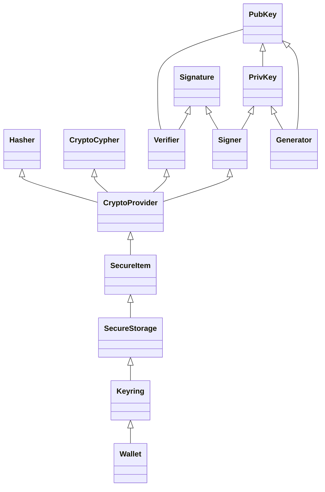
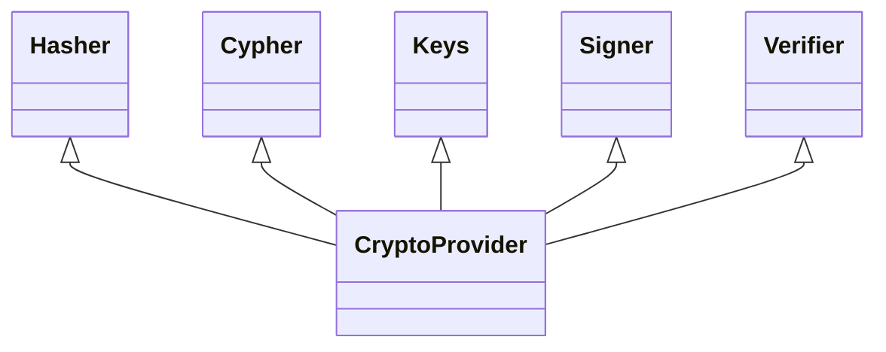
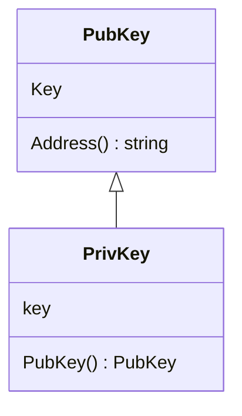
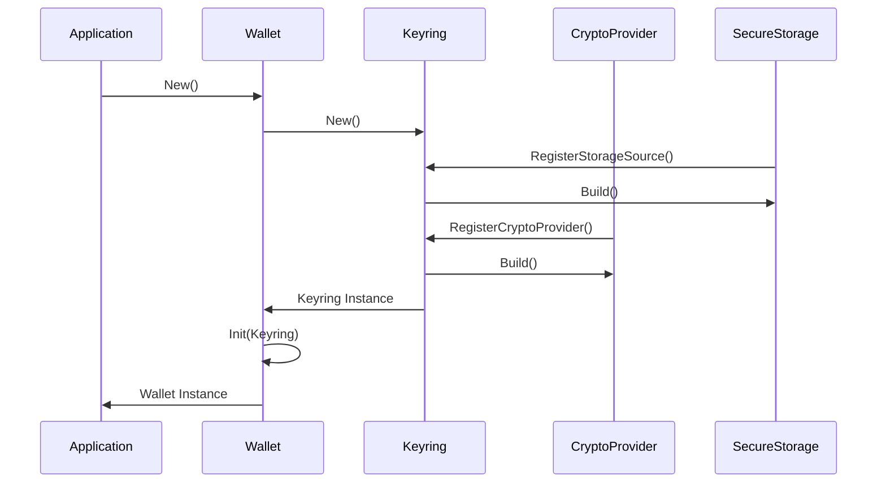
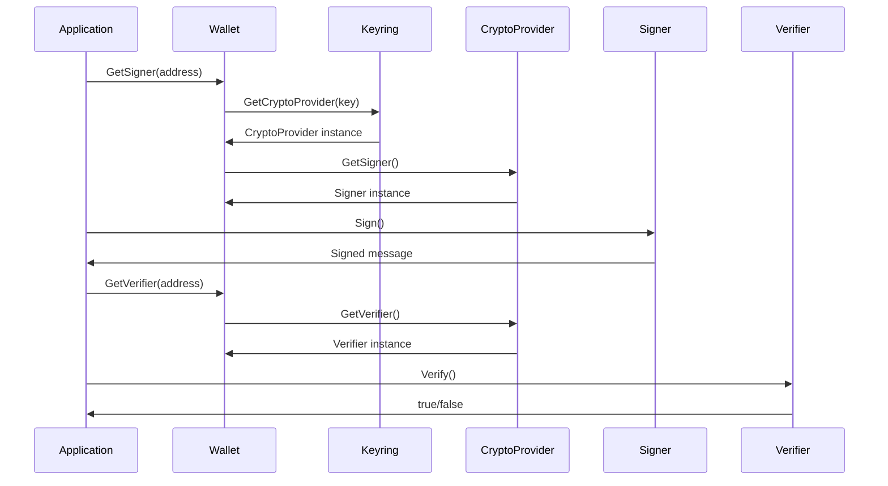

# ADR 777: Cryptography v2

## Change log

* {date}: {change log}
* ????-??-??: Initial Draft

## Status

{DRAFT | PROPOSED} Not Implemented

## Abstract

This ADR proposes a refactor of the crypto module's structure and interfaces to improve modularity, reusability, and maintainability.
The refactor involves defining types and interfaces, restructuring the module, and implementing unit tests.
The goal is to provide cleaner interfaces, easier extension, more test coverage and a single place of truth for the crypto functionality.

## Context

* Currently, there is no ADR providing a comprehensive description of the cryptographic module in the Cosmos SDK.
* There have been multiple requests for a more flexible and extensible approach to cryptography, address management, and more.
* Several open issues require significant changes for resolution.
* Similar efforts have been undertaken in the past concerning runtime modules.
* Existing signing types outside of the crypto module may pose challenges to backward compatibility while striving for a clean interface.
* Security implications must be considered during the module's redesign.

### Proposed architecture

The architecture objectives that define our design are based on the following concepts:

* **Modularity**: Users should be able to use only what they need instead of getting the whole module, keeping projects decoupled lightweight. 
* **Simplicity**: The proposal follows a modular API architecture, abstracting complex behaviour and defining a clear interaction between modules.
* **Extensibility**: Adding new features as key types, signing algorithms, etc. Has been made easier, in order to avoid forks and
promote users to come up with their own implementations of the interfaces, which should instantly work with the rest of the module without
modifications.

### **Modules**

Modules aim to encapsulate behaviours and to provide simple interface to extend and reuse.

These are the following reasons to use modules over packages:
- **Improved dependency management**: Modules have a built-in dependency management system that makes it easy to track and manage 
  dependencies.
- **Lightweight**: Users of the SDK could decide what modules to use, keeping simpler dependencies.
- **Simplified development**: Extending a module with a reduced scope allows users to handle their own implementations easier. 



#### Crypto provider

The *Crypto provider* serves as a middleware component responsible for managing the interaction with various instantiated cryptographic modules. It acts as a centralized controller, encapsulating the API of the crypto modules in a single location.
Through the Crypto provider, users can access functionality such as signing, verification, encryption, and hashing.

By abstracting the underlying cryptographic functionality, the *Crypto provider* enables a modular and extensible architecture. It allows users to easily switch between different cryptographic implementations without impacting the rest of the system.

It is created through a factory / builder method which contains all the implementations of the required interfaces.



```go
type CryptoProvider interface {
 CryptoProviderOptions 
 Build(SecureItem) (*CryptoProvider, error)

 GetSigner() (signer. Signer, error)
 GetVerifier() (verifier. Verifier, error)
 GetCipher() (cypher.Cipher, error)
 GetHasher() (Hasher, error)
}
```

##### **SecureItem**

A *Secure Item* is a structured data object designed for storing any type of data within a *Secure Storage* instance. In the context of this ADR, the **Blob** field of a Secure Item represents a "recipe" or blueprint for constructing the corresponding *Crypto Provider*. The **Blob** can be encoded in any format and should contain all the necessary configuration information required to instantiate the specific cryptographic modules that compose the *Crypto Provider*.

```go
type SecureItemMetadata struct {
	ModificationTime time.Time
	UUID             string
}
```

##### SecureStorage

A *Secure Storage* represents a secure vault where one or more *Secure Items* can be stored. It serves as a centralized repository for securely storing sensitive data. To access a *Secure Item*, users must interact with the *Secure Storage*, which handles the retrieval and management of keys.
Different implementations of *Secure Storage* will be available to cater to various storage requirements:

* FileSystem: This implementation stores the Secure Items in a designated folder within the file system.
* Memory: This implementation stores the Secure Items in memory, providing fast access but limited persistence.
* Keychain: This implementation is specific to macOS and utilizes the Keychain feature to securely store the Secure Items.

```go
type SecureStorageSourceMetadata struct {
    Type string
    Name string
}

type SecureStorageSourceConfig struct {
    Metadata SecureStorageSourceMetadata
    Config   any // specific config for the desired backend, if necessary
}

type SecureStorage interface {
  Build(SecureStorageSourceConfig) (SecureStorage, error)
  Get(string) (SecureItem, error)
  GetMetadata(string) (SecureItemMetadata, error)
  Set(string, SecureItem) error
  Remove(string) error
  Keys() ([]string, error)
}
```

##### **Keyring**

*Keyring* serves as a central hub for managing *Crypto Providers* and *Secure Storage* implementations. It provides methods to register *Crypto Provider*
and *Secure Storage* implementations. The **RegisterCryptoProvider** function allows users to register a Crypto Provider blueprint by providing a unique identifier and a builder function. Similarly, the **RegisterSecureStorage** function enables users to register a secure storage implementation by specifying a unique identifier and a builder function.


```go
type Keyring interface {
	RegisterCryptoProvider(string, ProviderBuilder)
	RegisterSecureStorage(string, SecureStorageBuilder)

	GetCryptoProvider(key string) (CryptoProvider, error)
	Keys() ([]string, error)
}
```

#### **Wallet**

The Wallet interface contains the blockchain specific use cases of the crypto module. It also serves as an API for:

* Signing and Verifying messages.
* Generating addresses out of keys

Since wallet interacts with the user keys, it contains an instance of the Keyring, it is also where the blockchain specific
logic should reside.

```go
type Wallet interface {
	Init(Keyring)
	GetSigner(address string) Signer
	GetVerifier(address string) Verifier
	Generate() string
}
```

#### Additional components

##### Blob

This is a wrapper for the widely used `[]byte` type that is used when handling binary data. Since crypto module handles sensitive information,
the objective is to provide some extra security capabilities around such type as:

* Zeroing values after a read operation.
* Securely handling data.

These blob structures would be passed within components of the crypto module. For example: Signature information

#### **Keys**

A key object is responsible for containing the **BLOB** key information. Keys might not be passed through functions and it is 
suggested to interact through crypto providers to limit the exposure to vulnerabilities. 



Base Key struct

```go
type KeyStruct struct {
 key Blob
}
```

Base key interface (common to private and public keys)

```go
type BaseKey interface {
 String() string
 Bytes() Blob
}
```

The generator module is responsible for generating such keys.

##### PubKey

```go
type PubKey interface {
 BaseKey
}
```

##### PrivKey

```go
type PrivKey interface {
 BaseKey
 Pubkey() PubKey //Generate a public key out of a private key
}
```

#### Signatures

A signature consists of a message/hash signed by one or multiple private keys. The main objective is to Authenticate a message signer 
trough their public key.

```go
type Signature struct {
 data Blob
}
```

##### Signer

Interface responsible for Signing a message and returning the generated Signature. It is an algorithm tied to a family of keys. 

```go
type Signer interface {
 Sign(Blob, PrivKey) (Signature, error)
}
```

##### Verifier

Verifies if given a message belongs to a public key by validating against it's respective signature.

```go
type Verifier interface {
 Verify(Blob, Signature, PubKey) (bool, error)
}
```

#### Cipher

A cipher is an api for encryption and decryption of data. Given a message it should operate through a secret.

```go
type Cipher interface {
    Encryptor
    Decryptor
}
```

##### Encryptor

Given a message and a secret, ciphers such message according to the implemented algorithm.

```go
type Encryptor interface {
    Encrypt(message Blob, secret Blob) (encryptedMessage Blob, error)
}
```

##### Decryptor

Given a Ciphered message and a secret, decrypts such message according to the implemented algorithm.

```go
type Decryptor interface {
    Decrypt(message Blob, secret Blob) (decryptedMessage Blob, error)
}
```

##### Hasher

This module contains the different hashing algorithms and conventions agreed on this matter. 

```go
type Hasher interface {
 Hash(input Blob) Blob
 CanHashIncrementally() bool
}
```

#### Module structure

Crypto module structure would look similar to this

- crypto/
  - docs
  - cipher/
    - encryption
    - decryption
    - hashing
  - signer/
    - signature
    - verifier
  - keyring/
    - secure_item
    - secure_storage
  - keys
  - crypto_provider
  - wallet

**Flow overview**

***Initialization***



***Signing and verifying a message***



## Alternatives

The alternatives may vary in the way of distributing the modules, putting some modules together as for example verify and signing in 
one place. This will affect the granularity of the code, thus the reusability and modularity. We aim to balance between simplicity and 
granularity.

## Decision

We will:

* Refactor module structure as described above.
* Define types and interfaces as the code attached.
* Refactor existing code into new structure and interfaces.
* Implement Unit Tests to ensure no backward compatibility issues.

## Consequences

### Backwards Compatibility

This refactor will involve changes on how the module is structured, providing cleaner interfaces and easier ways to use and extend. The impact should be minimal and not breaking any previous generated data.

The backward compatible sensitive elements are:

* Keys
* Signatures
* Encrypted data
* Hashes

### Positive

* Single place of truth
* Easier to use interfaces
* Easier to extend
* Unit test for each crypto module
* Greater maintainability
* Incentivize addition of implementations instead of forks
* Decoupling behaviour from implementation
* Sanitization of code

### Negative

* It will involve an effort to adapt existing code.
* It will require attention to detail and audition.

### Neutral

* It will involve extensive testing.

## Test Cases

- The code will be unit tested to ensure a high code coverage
- There should be integration tests around Wallet, keyring and crypto providers.
- There should be benchmark tests for hashing, keyring, encryption, decryption, signing and verifying functions.

## Further Discussions

> While an ADR is in the DRAFT or PROPOSED stage, this section should contain a
> summary of issues to be solved in future iterations (usually referencing comments
> from a pull-request discussion).
>
> Later, this section can optionally list ideas or improvements the author or
> reviewers found during the analysis of this ADR.


## References

* {reference link}
